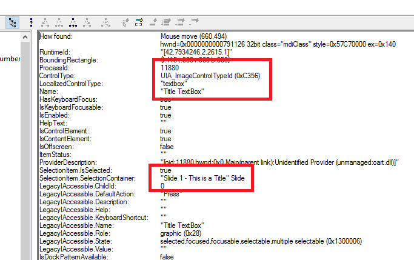

Powerpoint has a control hierarchy, and uses 'Slides' which are Custom controls. There is some weirdness associated with the contents of each page, as they appear to be Images, even though they are actually text on the screen. 



```
  AutomationWindow window = application.getWindow("This is text.pptx - PowerPoint");
  logger.info(window.name());

  AutomationPanel panelX = window.getPanel(Search.getBuilder().className("MDIClient").build());
  logger.info(panelX.name());
  logger.info(panelX.getClassName());

  AutomationPanel panel1 = panelX.getPanel(Search.getBuilder("PowerPoint Edit View - [This is text.pptx]").build());
  logger.info(panelX.name());
  AutomationPanel panel2 = panel1.getPanel(Search.getBuilder("Slide").build();
  logger.info(panel2.name());
  AutomationPowerpointSlide slide = panel2.getPowerpointSlide(Search.getBuilder("Slide 1 - This is text").build());
  logger.info(slide.name());

  // Oddly enough this is an image control, and has text in it's selection
  AutomationImage image = slide.getImage((Search.getBuilder("Title TextBox").build());
```            

