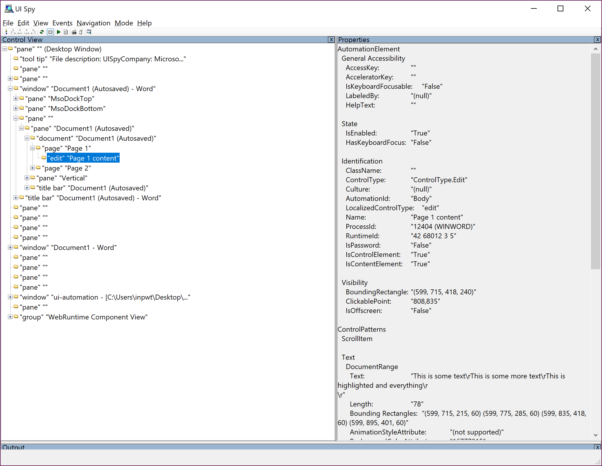

Word has a nice control hierarchy, and uses 'Pages' which are Custom controls.



```
AutomationWindow window = application.getWindow(Search.getBuilder("Document1 - Word").build());
logger.info(window.name());

AutomationPanel pane = window.getPanel(Search.getBuilder("Document1").build());
logger.info(pane.name());
logger.info(pane.getClassName());
AutomationPanel pane1 = pane.getPanel(Search.getBuilder(0).build());
logger.info(pane1.name());

AutomationDocument doc = pane1.getDocument(Search.getBuilder(0).build());
logger.info(doc.name());

AutomationDocumentPage page0 = doc.getPage(Search.getBuilder(0).build());
logger.info(page0.name());

AutomationEditBox edit = page0.getEditBox(Search.getBuilder(0).build());
logger.info(edit.name());

String text = edit.getText();
logger.info("Text = " + text.substring(0,10));
```